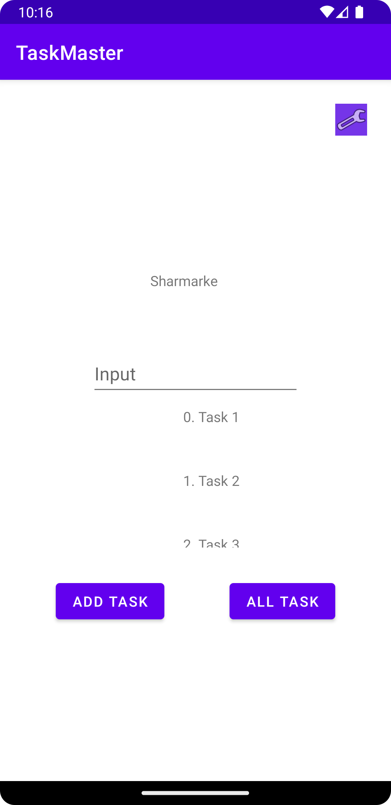
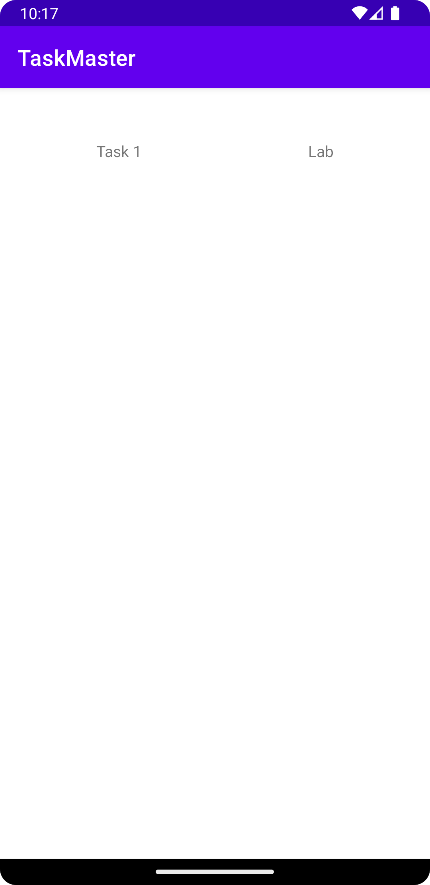
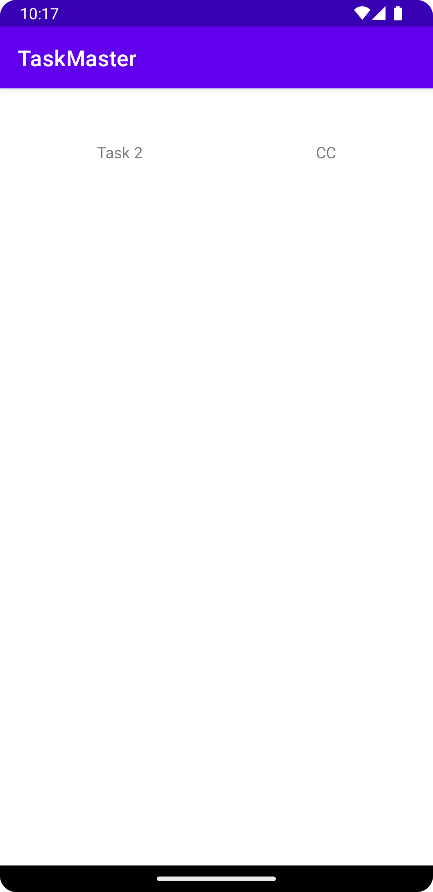
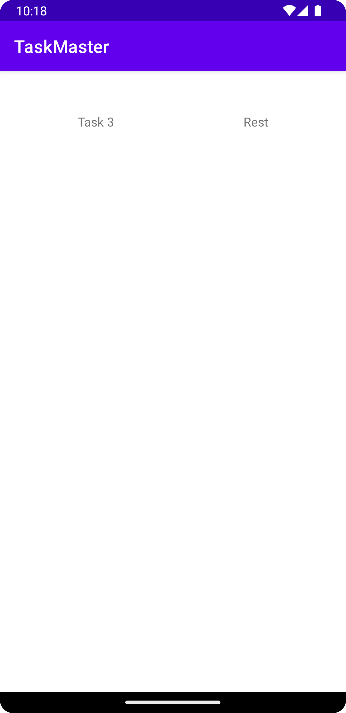
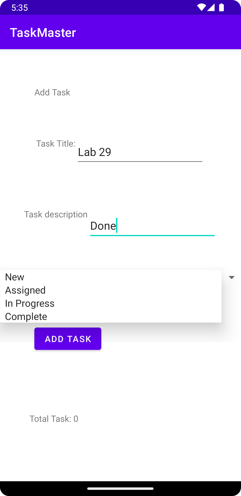
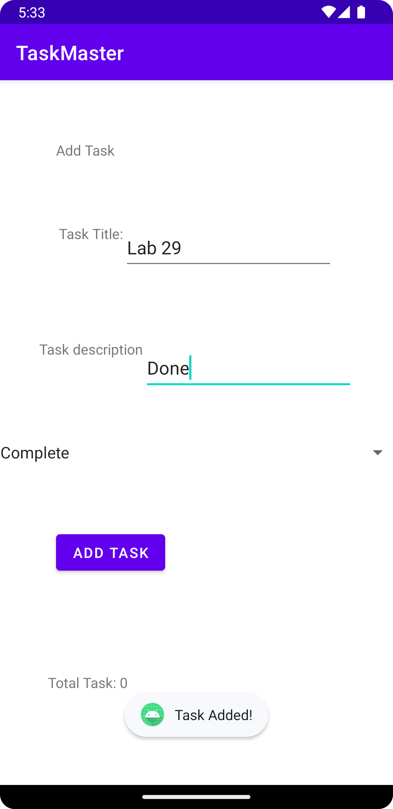
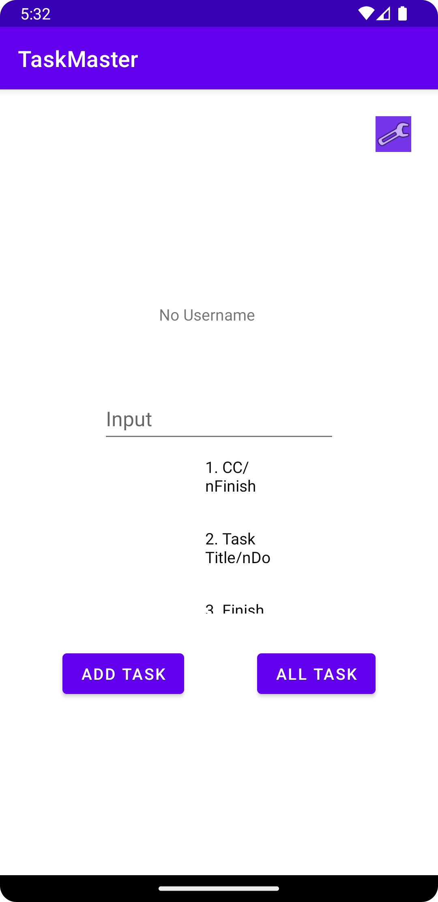
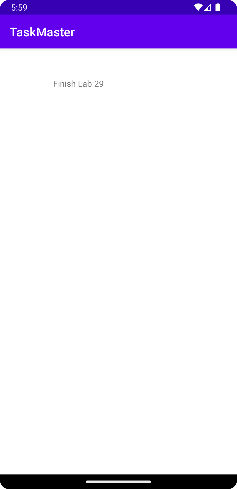

# Lab 26

This is an intro to Android Studios and adding two buttons that take you to different pages, add task that has a two edit text boxes and a button when hit shows a hidden text of "submitted!" and all task that has an image.

# Lab 27

Today's changes were to add three buttons that redirect to their own task details page, add a settings to edit the username and onResume would display it w/o rerunning the app. Also inputted some test.

# Lab 28

Today's changes were to refractor our code, getting rid of the buttons on the home page and replace them with Recycler View. Created packages for the activities, adapter, fragments, and model. Also added test to ensure that the Recycler View works.

# Lab 29

The changes made where to get rid of the hardcoded RecyclerView and place a spinner to add the tasks, you then are able to see those added task in the home page.

# Lab 31
Didn't add anything new already had tests made for each task that is on canvas for lab 31.