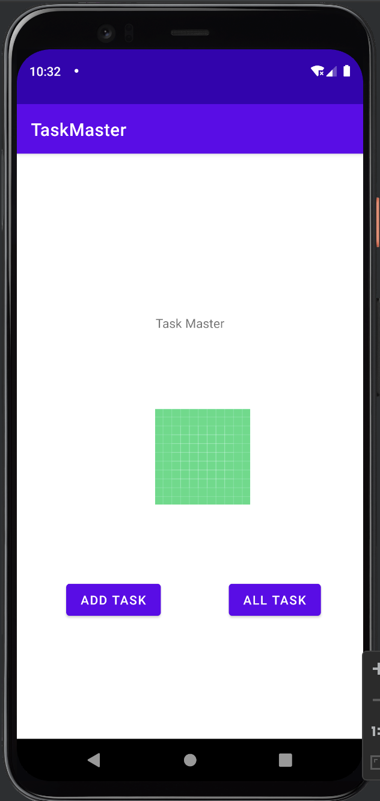
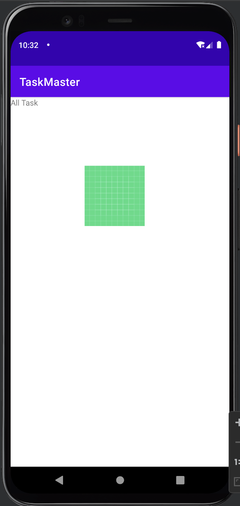
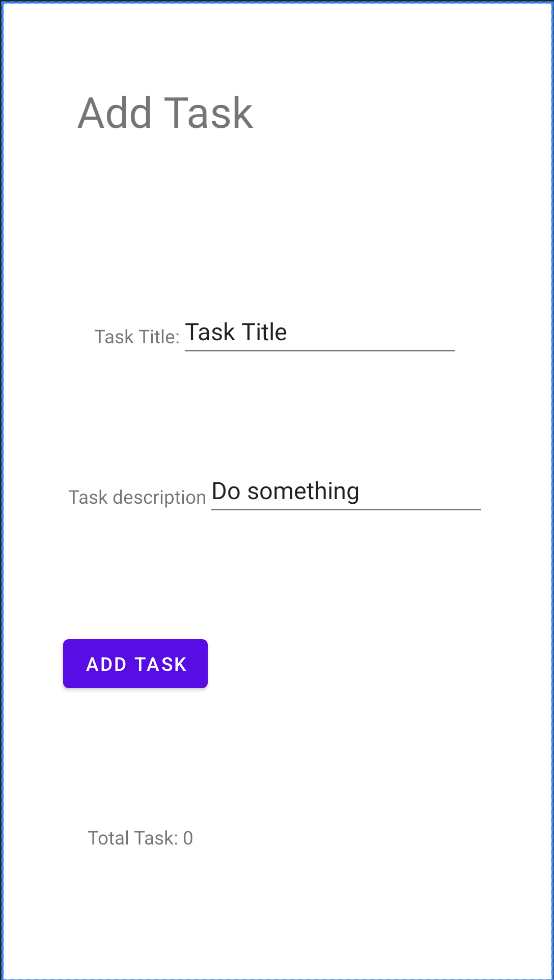
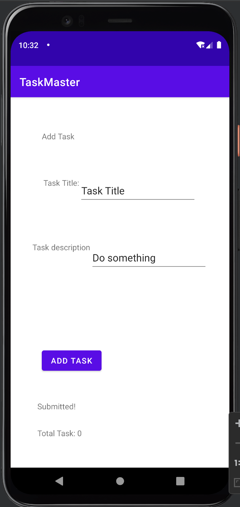
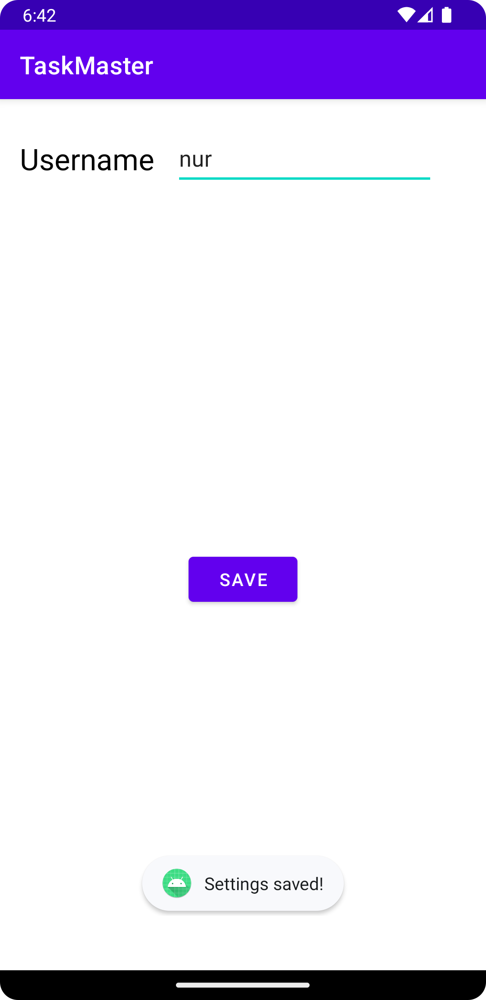
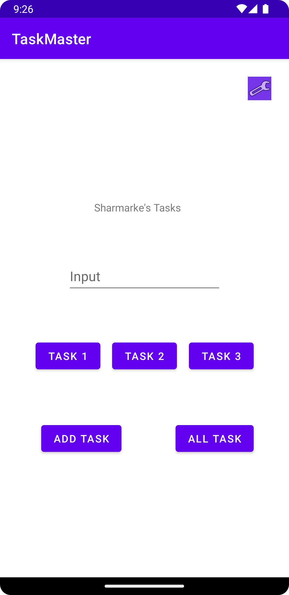
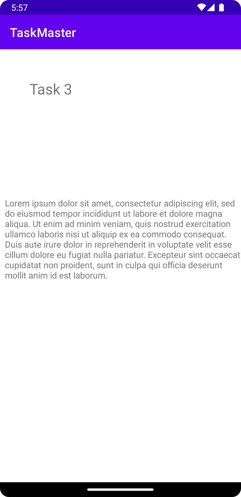

# Lab 26

This is an intro to Android Studios and adding two buttons that take you to different pages, add task that has a two edit text boxes and a button when hit shows a hidden text of "submitted!" and all task that has an image.

# Lab 27

Today's changes where to add three buttons that redirect to their own task details page, add a settings to edit the username and onResume would display it w/o rerunning the app. Also inputted some test.